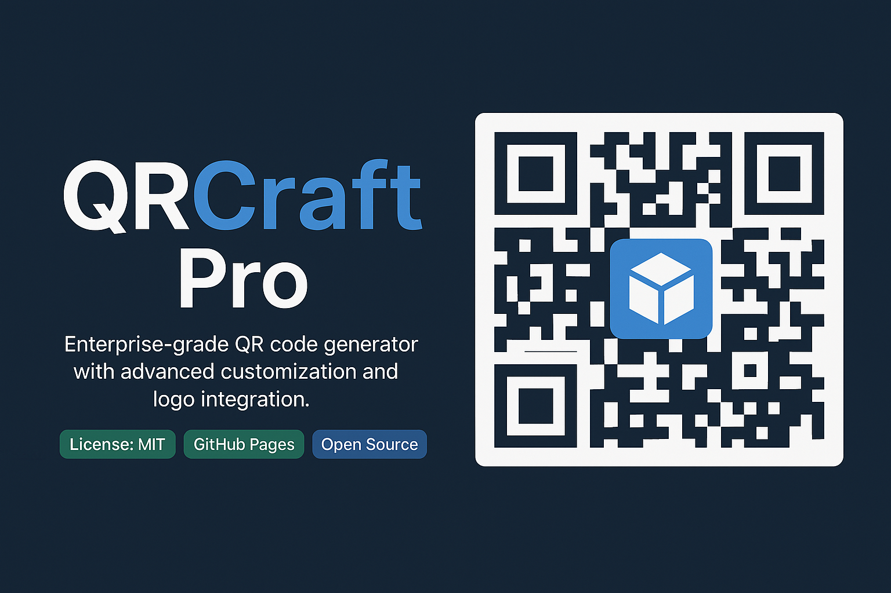

<!-- Banner Image -->


# QRCraft Pro
<!-- Badges -->
[](LICENSE)
[](https://rorrimaesu.github.io/QRCraft-Pro/)
[]()

Enterprise-grade QR code generator with advanced customization and logo integration. Free and open-source.

**QRCraft Pro** is an enterprise-grade QR code generator built with HTML, CSS, and JavaScript. It provides powerful customization options—from color and error correction to logo integration with adjustable settings—all for free.

## Table of Contents

- [Overview ⚡](#overview)
- [Features ✨](#features)
- [Demo 🚀](#demo)
- [Installation & Deployment 🛠](#installation--deployment)
- [GitHub Pages Setup 🌐](#github-pages-setup)
- [Usage 📲](#usage)
- [Contributing 🤝](#contributing)
- [License 📄](#license)
- [Support ❤️](#support)

## Overview
> QRCraft Pro is designed for businesses and individuals who need a professional QR code solution. Trusted by renowned organizations and used by over 10,000 professionals worldwide.

QRCraft Pro is designed for businesses and individuals who need a professional QR code solution. The tool is trusted by organizations like Green Clean, Veritas News AI, and Naked Sage Astrology, and is used daily by over 10,000 professionals worldwide.

## Features

- **Lightning Fast Generation:** Create QR codes quickly using optimized algorithms.
- **Customizable Design:** Choose from various color schemes, sizes, and styles.
- **Logo Integration:** Easily upload and customize your logo with adjustable opacity, size, border radius, and position.
- **Responsive & Modern UI:** Developed with a clean, modern design suitable for enterprise-grade needs.
- **Free & Open Source:** Enjoy all the features—no hidden costs or registrations.

## Demo
A live demo of QRCraft Pro is available on [GitHub Pages](https://rorrimaesu.github.io/QRCraft-Pro/).  

## Installation & Deployment

1. **Clone the Repository:**

   ```bash
   git clone https://github.com//rorrimaesu/qrcraft-pro.git
   cd qrcraft-pro
   ```

2. **Open Locally:**

   Simply open the `landing.html` or `index.html` file in your browser to test the project.


## Usage

1. **Generate a QR Code:**  
   Fill in the URL or text content, choose a size, and adjust additional settings (error correction, foreground/background colors). Click on *Generate QR Code*.

2. **Logo Customization:**  
   Upload your logo and adjust its settings (size, opacity, border radius, and position) to integrate it into your QR code.

3. **Download:**  
   Once generated, click on the download button to save your QR code as a PNG image.

## Contributing

Contributions are welcome! If you'd like to improve QRCraft Pro, please follow these steps:
- Fork the repository.
- Create a feature branch.
- Commit and push your changes.
- Create a pull request with a clear description of your updates.

## License

This project is licensed under the MIT License. See the [LICENSE](LICENSE) file for details.

## Support

If you find value in QRCraft Pro, consider becoming a proud supporter—your contribution does more than fund future updates; it fuels innovation and empowers a community of over 10,000 professionals.

**Why Your Support Matters:**

- **Exclusive Perks:** Be the first to access upcoming premium features and AI-powered enhancements.
- **Community & Social Proof:** Join an elite network of industry leaders who trust QRCraft Pro to drive their success.
- **Reciprocity:** Your backing motivates the developer to continuously improve the project, ensuring every contribution makes a real impact.
- **Limited-Time Rewards:** Act now to secure special benefits available exclusively to early backers.

Support the project by clicking the image below:

[](https://www.buymeacoffee.com//rorrimaesu)

Support the project and help propel QRCraft Pro to new heights by visiting our [Buy Me A Coffee](https://www.buymeacoffee.com//rorrimaesu) page. Every coffee you buy inspires innovation!

---

_QRCraft Pro is built with passion to deliver reliable QR code generation tools to the community. We welcome feedback and suggestions!_
